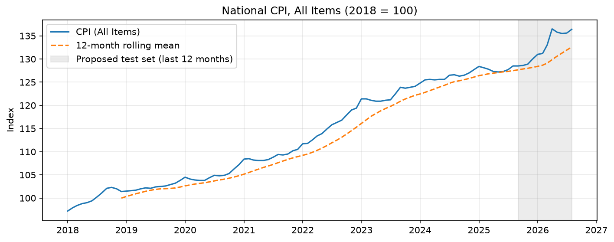
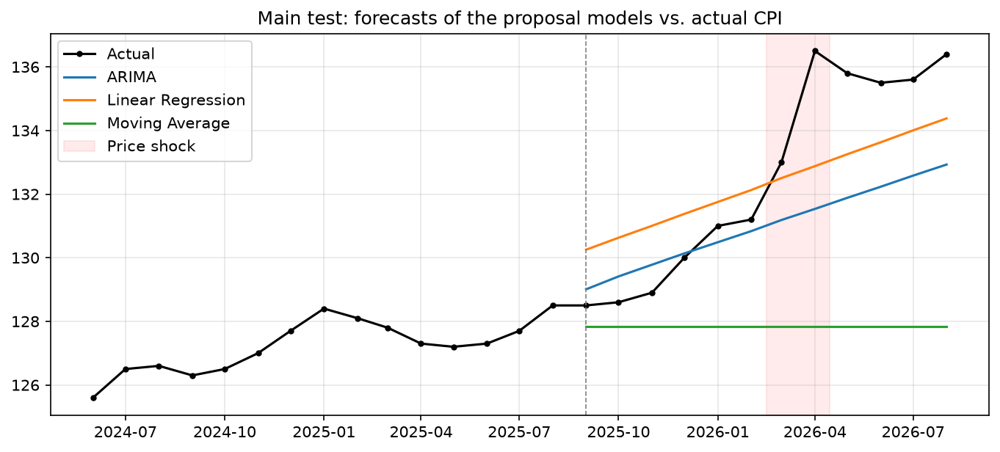
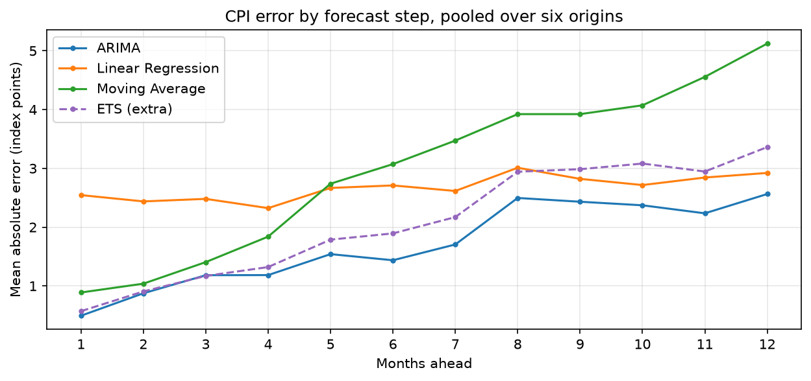
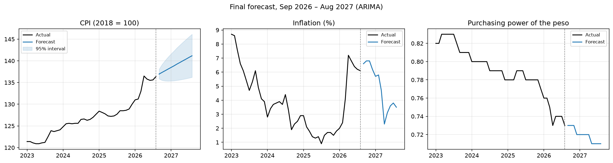

# PresyoPH – Modeling Method and Results

*Member 2 (Data Scientist / Backend). Draft for the October 4 submission.*

This document describes how the CPI forecasting models were built, evaluated, and selected, and what they found. It is written for the team and as source material for the paper. Every number here comes from the notebooks in `notebooks/` and the files in `datasets/outputs/`, which can be regenerated from the raw PSA data (see [Reproducing the results](#9-reproducing-the-results)).

**In short:** national all-items CPI was forecast with ARIMA, Linear Regression, and Moving Average (plus ETS as an unofficial extra). Evaluated over six forecast periods (72 months per model), **ARIMA was the most accurate on all three metrics** and was selected. Its forecast has CPI rising from 136.4 (August 2026) to about 141.2 by August 2027.

---

## 1. Scope

- **Forecasting target:** national CPI, *0 – All Items* (2018 = 100), as stated in the proposal ("CPI as the sole forecasting target").
- **Inflation and purchasing power** are not modeled separately. They are calculated from each CPI forecast with PSA's own formulas:
  - inflation (%) = (CPI<sub>t</sub> ÷ CPI<sub>t−12</sub> − 1) × 100
  - purchasing power = 100 ÷ CPI<sub>t</sub>

  Applied to the historical data, both formulas reproduce PSA's published series exactly (0 differences over 92 and 104 months). Deriving them keeps the three forecasts consistent with each other and stays within the proposal's scope, since inflation and purchasing power are never used as predictors.
- **FIES** (2023 only) is not forecast; it is used descriptively on the dashboard.

## 2. Data

| Item | Value |
|---|---|
| Source | PSA OpenSTAT exports in `datasets/raw/` (CPI_1–3.xlsx, Inflation_1–2.xlsx, PurchasingPower.xlsx) |
| Series | PHILIPPINES, 0 – ALL ITEMS, CPI 2018 = 100 |
| Period | January 2018 – August 2026, 104 monthly observations, no missing values |
| Unreleased months | September–December 2026 are marked ".." by PSA and excluded, not imputed |

The CPI_2 and CPI_3 exports both contain 2023; their 20,160 overlapping values are identical, so duplicates were dropped without conflict.

## 3. Exploratory analysis

Full details: `notebooks/01_exploratory_checks.ipynb`.

| Check | Result | Implication |
|---|---|---|
| Trend | CPI rose 40.3% (97.2 → 136.4); strength of trend 0.99. Fastest rises: 2022 (+6.9%), 2018 (+4.3%), Jan–Aug 2026 (+4.1%). | Strong, steady upward trend |
| Stationarity | Level: non-stationary (ADF p = 0.99; KPSS p ≤ 0.01). First difference: stationary (ADF p < 0.001; KPSS p ≥ 0.10). Adding a seasonal difference: ADF borderline (p = 0.057) and ACF at lag 12 = −0.31, a sign of over-differencing. | ARIMA with d = 1 and no seasonal differencing (D = 0) |
| Seasonality | Weak: strength of seasonality 0.17; yearly seasonal swing below 2.5 index points through 2024. Calendar-month effect marginal (Kruskal–Wallis p = 0.039), mainly January (+0.8% average monthly change). | Seasonal terms tested as a candidate only |
| Autocorrelation | ACF and PACF of the first difference: one significant spike at lag 1 (0.26). Ljung–Box p = 0.25, 0.52, 0.85 at lags 6, 12, 24. | Low-order ARIMA; p, q ∈ {0, 1, 2} |
| Unusual periods | In March–April 2026 CPI rose 1.4% and then 2.6% in a single month; inflation went from 2.4% (Feb) to 7.2% (Apr). The test period is 2.5 times as volatile as the end of the training data. | No model can anticipate this from past CPI alone; results are reported before and after the shock |



## 4. Evaluation design

Settings are in `modeling/config.py`.

**Train/test split.** Training: January 2018 – August 2025 (92 months). Test: September 2025 – August 2026 (12 months), about 88/12. For time series the test size is set by the forecast horizon rather than a fixed percentage such as 70/30: the dashboard forecasts up to 12 months ahead, so 12 test months measure exactly that, and they cover one full seasonal cycle. Training keeps 7.7 years of data, above the proposal's requirement of two to three seasonal cycles.

**Horizon.** Every model forecasts 12 months from its origin. The dashboard's 3- and 6-month views are the first 3 and 6 months of the same forecast.

**Rolling-origin evaluation.** Because the test period contains an unusual price shock, the models were also evaluated from five earlier origins (August 2022, February 2023, August 2023, February 2024, August 2024), each forecasting the following 12 months with an expanding training window. All five end before the test period. At every origin, each model is re-tuned using only the data available up to that origin.

**Metrics.** MAE, RMSE, and MAPE. MAPE for inflation is large and unstable because actual inflation was as low as 0.9–1.5% in some months; it should be read alongside MAE and RMSE.

**Selection rule.** Applied to CPI: the model with the lowest error on at least 2 of the 3 metrics wins; otherwise the model with the lowest RMSE. One model is selected for all three variables, so the dashboard's CPI, inflation, and purchasing power forecasts always agree.

**Selection basis – changed after the results were seen.** The rule was first to be applied to the 12-month test set alone, with rolling origin as a check only. On the test set alone Linear Regression wins, but largely because of the 2026 shock (see 6.1). The basis was therefore changed to the **pooled results of all six origins** (72 forecast months per model). Both results are reported below. This change must be stated openly in the paper.

## 5. Models

Code: `modeling/models.py`. Each model is tuned on its training data only.

| Model | Specification | Tuning | Chosen at the test origin (Aug 2025) |
|---|---|---|---|
| **ARIMA** | ARIMA(p, 1, q) with drift (a constant average monthly change) | 18 candidates: p, q ∈ {0, 1, 2}, with and without a seasonal AR(1)<sub>12</sub> term; lowest AIC, but among candidates within 2 AIC points the one with fewest parameters (parsimony rule, Burnham & Anderson 2002) | ARIMA(1, 1, 0), drift 0.349 per month, AR coefficient 0.35 |
| **Linear Regression** | CPI = a + b × t, ordinary least squares on a time index | none | CPI = 95.37 + 0.375 t (R² = 0.968) |
| **Moving Average** | flat forecast equal to the mean of the last k months | k ∈ {3, 6, 12}, lowest RMSE on the last 12 training months | k = 3 (validation RMSE 1.41 vs. 1.71 and 2.46) |
| **ETS** *(extra, not in the proposal)* | Holt's exponential smoothing, additive error and trend | damped or not, by AIC with the same parsimony rule | no damping; level smoothing ≈ 1.0, trend smoothing 0.088 |

**Prediction intervals (95%).** ARIMA and ETS: from the fitted model. Linear Regression: OLS prediction interval. Moving Average: empirical quantiles of its own past errors at each step ahead. Inflation and purchasing power intervals are converted from the CPI interval; both formulas move in one direction with CPI, so the conversion is exact.

**Diagnostics at the test origin.**
- ARIMA residuals show no remaining autocorrelation (Ljung–Box p = 0.44, 0.29, 0.36 at lags 6, 12, 24). They are slightly skewed and heavy-tailed (Jarque–Bera p = 0.03), so intervals are approximate.
- Linear Regression's residuals are strongly autocorrelated (Durbin–Watson 0.068, far below 2), which violates the OLS independence assumption. Its prediction interval stays about 7.5 points wide at every step instead of widening with the horizon.
- AIC alone would have chosen the seasonal ARIMA(0, 1, 1)(1, 0, 0)<sub>12</sub>, but only by 1.04 points; the parsimony rule chose the simpler non-seasonal model, consistent with the weak seasonality. Across the rolling-origin folds the seasonal term was chosen in 3 of 5, so seasonality is weak but not entirely absent.

## 6. Results

Full details: `notebooks/03_evaluation.ipynb`. MAE and RMSE for CPI are in index points; MAPE in percent.

### 6.1 Main test (September 2025 – August 2026)

CPI forecast error by period:

| Model | Full year RMSE | Before shock (Sep–Feb) RMSE | After shock (Mar–Aug) RMSE | Mean error before shock |
|---|---|---|---|---|
| ARIMA | 2.54 | **0.59** | 3.54 | −0.24 |
| Linear Regression | **1.93** | 1.58 | **2.24** | −1.49 |
| Moving Average | 5.67 | 2.17 | 7.72 | +1.87 |
| ETS *(extra)* | 3.42 | 0.80 | 4.77 | +0.35 |

*Mean error = actual − forecast; negative means the forecast was too high.*

- Before the shock, ARIMA was clearly the most accurate.
- After the shock every model was too low; none anticipated the jump, as expected for models that use only past CPI.
- Linear Regression wins the full year because its forecasts were 1.49 points too high before the shock, and the jump lifted actual CPI up to its trend line. Its lead comes from the shock rather than from tracking CPI more closely.



### 6.2 Rolling origin and pooled results

CPI RMSE at each origin:

| Origin | ARIMA | Linear Regression | Moving Average | ETS *(extra)* |
|---|---|---|---|---|
| Aug 2022 | **2.02** | 5.26 | 4.90 | 2.75 |
| Feb 2023 | **2.57** | 3.93 | 2.63 | 3.66 |
| Aug 2023 | 1.39 | 3.00 | 3.64 | **0.50** |
| Feb 2024 | 1.42 | **1.36** | 2.06 | 2.13 |
| Aug 2024 | 1.77 | **1.25** | 1.41 | 1.87 |
| Aug 2025 (main test) | 2.54 | **1.93** | 5.67 | 3.42 |

Among the proposal models, ARIMA ranks first at the three earlier origins and Linear Regression at the three most recent. Linear Regression has done well recently but poorly earlier, especially from August 2022.

**Pooled over all six origins (72 forecast months per model) – the selection basis:**

| Model | CPI MAE | CPI RMSE | CPI MAPE (%) | Inflation MAE | Inflation RMSE | Purchasing power MAPE (%) |
|---|---|---|---|---|---|---|
| **ARIMA** | **1.71** | **2.01** | **1.36** | **1.42** | **1.66** | **1.45** |
| Linear Regression | 2.67 | 3.14 | 2.15 | 2.25 | 2.69 | 2.04 |
| Moving Average | 3.00 | 3.71 | 2.37 | 2.48 | 3.05 | 2.04 |
| ETS *(extra)* | 2.10 | 2.61 | 1.66 | 1.74 | 2.16 | 1.76 |

### 6.3 Model selection

| Basis | Selected | Reason |
|---|---|---|
| **Pooled, six origins (used)** | **ARIMA** | Lowest MAE, RMSE, and MAPE for CPI (3 of 3) |
| Main test only (original plan) | Linear Regression | Lowest MAE, RMSE, and MAPE for CPI (3 of 3) |

ARIMA is also the most accurate for the derived inflation and purchasing power on the pooled results, so the same model would be chosen for every variable. Including ETS does not change either result.

### 6.4 Error by forecast step

Mean absolute CPI error by months ahead, pooled over six origins:

| Months ahead | ARIMA | Linear Regression | Moving Average | ETS *(extra)* |
|---|---|---|---|---|
| 1 | **0.49** | 2.54 | 0.89 | 0.57 |
| 3 | 1.18 | 2.48 | 1.41 | **1.17** |
| 6 | **1.44** | 2.71 | 3.07 | 1.89 |
| 12 | **2.56** | 2.92 | 5.12 | 3.36 |

ARIMA's error grows steadily with the horizon, so the dashboard's 3-month view is considerably more reliable than its 12-month view. Linear Regression's error is about 2.5 points even one month ahead, because its line reflects the long-run trend rather than the latest CPI level.



### 6.5 ETS (extra model)

ETS ranks second on the pooled results (CPI RMSE 2.61), between ARIMA and Linear Regression, and was the best model from one origin (August 2023). Since it does not beat ARIMA overall, adding it to the proposal would not change the final model. It can be presented to the instructor as a fourth model for comparison if desired.

## 7. Final forecast (September 2026 – August 2027)

The selected model was refit on all 104 months with the same tuning procedure, giving **ARIMA(0, 1, 1) with a drift of 0.383 points per month**. (The order differs from the test-origin model because the tuning is repeated on the longer data; at the test origin the two orders were within 0.1 AIC points.)

| Month | CPI (95% interval) | Inflation, % (95% interval) | Purchasing power (95% interval) |
|---|---|---|---|
| Sep 2026 | 136.95 (135.85–138.05) | 6.6 (5.7–7.4) | 0.73 (0.72–0.74) |
| Nov 2026 | 137.71 (135.38–140.05) | 6.8 (5.0–8.7) | 0.73 (0.71–0.74) |
| Feb 2027 | 138.86 (135.42–142.31) | 5.8 (3.2–8.5) | 0.72 (0.70–0.74) |
| Apr 2027 | 139.63 (135.62–143.64) | 2.3 (−0.6–5.2) | 0.72 (0.70–0.74) |
| Aug 2027 | 141.16 (136.20–146.13) | 3.5 (−0.1–7.1) | 0.71 (0.68–0.73) |

All 12 months are in `datasets/outputs/forecasts.csv`.

- CPI is forecast to keep rising at about the long-run average rate.
- Inflation stays around 6–7% until early 2027, then drops to 2.3% in April 2027. This is a **base effect**: from April 2027 prices are compared with the already-high April 2026 level, so the year-on-year rate falls even though prices keep rising.
- The intervals widen quickly; by mid-2027 the inflation interval spans roughly 0–7%. The 12-month view should be presented as indicative only.



## 8. Limitations

1. **Past CPI only.** The models cannot anticipate shocks caused by external factors such as fuel prices, exchange rates, policy, or supply disruptions, as the March–April 2026 jump shows.
2. **The selection basis was changed after the results were seen.** This is disclosed, and both results are reported, but it means the selection was not fully pre-specified.
3. **Limited evaluation data.** Six forecast periods (72 months, overlapping) is a modest sample. Linear Regression did better at the three most recent origins, so the ranking could change as new data arrives.
4. **Approximate intervals.** ARIMA's residuals are slightly non-normal; Linear Regression's interval does not widen with the horizon; Moving Average's interval lies entirely above its forecast at longer steps because the method has always under-forecast a rising CPI.
5. **Inflation MAPE is unstable** when inflation is low and should not be used on its own.
6. **Temporary data loading.** Until Member 1's database is ready, data is read directly from the raw PSA exports by `modeling/temp_loader.py`.

## 9. Reproducing the results

```
.venv/Scripts/python -m pip install -r requirements.txt
.venv/Scripts/python -m modeling.run_pipeline        # writes datasets/outputs/
.venv/Scripts/python -m pytest                       # 35 backend tests
```

| File | Purpose |
|---|---|
| `modeling/config.py` | Split, horizon, rolling origins, tuning grids, selection rule |
| `modeling/temp_loader.py` | Reads the raw PSA exports (temporary) |
| `modeling/derive.py` | Inflation and purchasing power from CPI |
| `modeling/models.py` | The four models |
| `modeling/evaluation.py` | Metrics, selection rule, rolling origin |
| `modeling/run_pipeline.py` | Runs everything and writes `datasets/outputs/` |
| `backend/data.py` | Functions for the dashboard pages |
| `notebooks/01–03` | Exploratory checks, model building, evaluation |

## 10. Suggested changes to the paper

These are needed so YEAR 4_2 / SIA TITLES match what was done. The team should agree on them before they go into the paper.

1. **Section IV, Forecasting Evaluation:** state the 12-month test set, the rolling-origin evaluation, the selection rule, and the change of selection basis. Suggested text:
   > *The last 12 months of CPI data (September 2025 to August 2026) were withheld as the main test set, and the models were also evaluated with a rolling-origin approach on five earlier 12-month periods. The final model was selected on the pooled results of all six evaluation periods (72 forecast months per model), choosing the model with the lowest error on at least two of the three metrics. Selection was originally planned on the main test set alone; it was changed to the pooled results because the main test period contains a sudden price increase in March–April 2026 that strongly favoured one model. On the main test set alone, Linear Regression would have been selected; on the pooled results, ARIMA was selected.*
2. **Analytics Technique:** add the model specifications from section 5 (d = 1 with drift and AIC with a parsimony rule for ARIMA; time-index regression; k chosen on a validation window for Moving Average).
3. **Research Design / Scope and Feasibility:** add one sentence: *Forecasted inflation and purchasing power are derived from the forecasted CPI using PSA's formulas rather than modeled separately; CPI remains the sole forecasting target.*
4. **Proposed System Features (5) and Dashboard Output (2):** mention that inflation and purchasing power forecasts are shown alongside the CPI forecast.
5. **Data Sources:** add the base years (CPI, inflation, and purchasing power: 2018 = 100; FIES: constant 2021 prices). The text "ARIMA/SARIMA … including the seasonal-differencing step" can be updated: seasonal differencing was tested and rejected (section 3).
6. **Section V, Tools:** Statsmodels was used for ARIMA, ETS, and the regression; Scikit-learn was not needed (metrics are computed directly).
7. **Only if the instructor approves ETS:** update Research Question 5, Objective 3, the Analytics Technique, and the Evaluation Plan to name four models.
